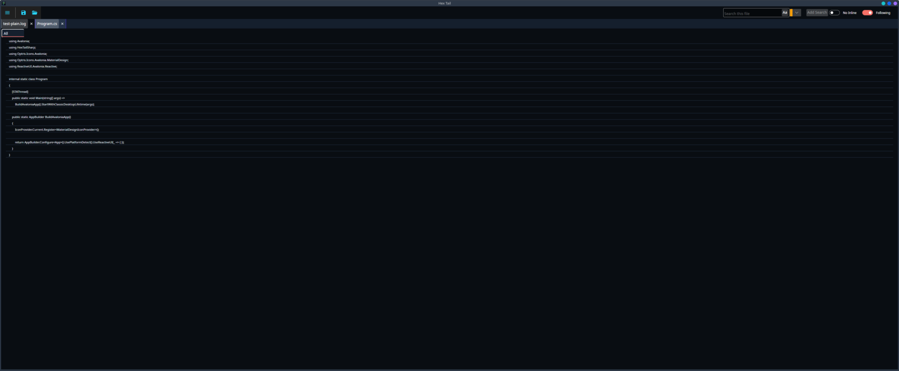

# HexTail


HexTail is a native cross-platform desktop application for watching live log
files. It opens plaintext, `.logfmt`, and `.jsonl` files, keeps multiple files and
searches in separate tabs, and renders a bounded, virtualized log view without
a browser, WebView, JavaScript runtime, or local HTTP server.

Elastic sources use separate Kibana and Elasticsearch URLs, generic
server/namespace mappings, ordered output fields, a five-minute initial
lookback, and native OS credential storage for authenticated connections.



## Features

- Live tailing with append, truncate, rotation, and missing-file recovery.
- Multiple files in tabs, opened from the native picker, drag-and-drop, or the
  command line.
- Literal and regular-expression searches with optional case sensitivity and a
  separate highlight color for each search.
- Independent follow-tail toggles for the All view and each search view.
- Optional inline context view with its own scroll position.
- Global case-insensitive labels and exclusions from the settings pane.
- Display density, log font size, and theme settings.
- Session persistence for open files, searches, settings, window geometry, and
  context-pane size.

## Quick start

### Prerequisites

- .NET 10 SDK

### Run

```bash
dotnet restore src/HexTail.slnx
dotnet run --project src/HexTail/HexTail.csproj -- /path/to/application.log
```

You can also start without a path and use **Open**, drag files onto the window,
or pass multiple paths:

```bash
dotnet run --project src/HexTail/HexTail.csproj -- \
  /var/log/application.log /var/log/worker.log
```

## Using HexTail

1. Open one or more files with the folder button, `Ctrl+O`/`Cmd+O`, or
   drag-and-drop.
2. Select a file tab. The **All** view shows the complete buffered tail.
3. Enter a query in **Search this file** and press Enter or **Add Search**.
   Search tabs show matching lines; the All view highlights the same matches.
4. Choose **Following** to keep a view at the newest line or match. Turn on
   **Inline Shown** to display the selected line with surrounding context.
5. Use **Settings** to manage global labels and exclusions or change display
   preferences.

### Keyboard shortcuts

| Shortcut | Action |
| --- | --- |
| `Ctrl+O` / `Cmd+O` | Open files |
| `Ctrl+F` / `Cmd+F` | Focus the search box |
| `Ctrl+S` / `Cmd+S` | Save the current session |
| `Esc` | Close the settings pane |

### Input formats

Files with a `.logfmt` extension use the built-in `key=value` parser. Files with
a `.jsonl` extension parse JSON object fields, flattening nested objects with
dot-separated keys. All log lines remain displayed as raw text; malformed
logfmt/JSONL lines and non-object JSONL values are treated as plain text.

The default in-memory limit is 100,000 lines per file. It can be changed in
`AppSettings.MaxLines` in the application code.

### Session data

HexTail saves session state as `HexTailSharp/session.json` under the operating
system application-data directory. The file is written atomically and stores
open paths, searches, settings, window geometry, and context-pane size. Remove
that file when a clean first-launch session is needed.

## Development

Restore, build, and test the solution with:

```bash
dotnet restore src/HexTail.slnx
dotnet build src/HexTail.slnx -c Release --no-restore
dotnet test src/HexTail.Tests/HexTail.Tests.csproj -c Release
```

Publish a desktop build for a runtime identifier:

```bash
dotnet publish src/HexTail/HexTail.csproj -c Release \
  -r linux-x64 --self-contained false
```

Supported publish examples are `linux-x64`, `win-x64`, `osx-x64`, and
`osx-arm64`. See [the native build guide](docs/native-build.md) for the full
matrix, hooks, manual smoke pass, and session details.

## Project documentation

- [Architecture](docs/architecture.md) — current runtime boundary, data flow,
  component map, and limits.
- [Native build guide](docs/native-build.md) — restore, test, publish, hooks,
  and manual verification.
- [Native desktop design](docs/specs/2026-07-22-log-tail-app-design.md) —
  implemented behavior and design rationale.

Historical plans and specs may describe an earlier browser-based design. The
current implementation is the native Avalonia desktop application documented
above.

## Contributing

Keep changes scoped to the native desktop boundary and add or update tests for
behavioral changes. Before committing, restore the local tools and install the
formatting hook:

```bash
dotnet tool restore
dotnet husky install
```

The pre-commit hook formats staged C# files with CSharpier. Use the existing
Conventional Commit format, for example `fix(search): handle invalid regex`.

## License

See [LICENSE](LICENSE).
