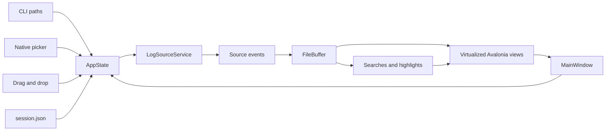

# HexTail architecture

HexTail is a single-process .NET 10 desktop application built with Avalonia
12.1.1. It owns the window, file pickers, drag-and-drop, rendering, tailers,
and persistence locally. There is no browser, WebView, JavaScript runtime, or
HTTP server in the runtime path.

Elastic sources use a dual-endpoint, source-neutral path: Kibana provides
supported data-view metadata and Elasticsearch provides read-only PIT/search
requests. Local files and remote sources emit parsed `Line` batches into the
same buffer, search, context, and virtualized renderer. Secrets use the native
credential vault and are excluded from session JSON.

## Runtime flow

1. `Program` creates the Avalonia desktop lifetime and registers the Material
   Design icon provider.
2. `App` applies the dark Cyber Tail theme and creates `MainWindow` with the
   command-line paths.
3. `AppState` restores session data, opens each path, and owns the selected
   file, settings, searches, and window state.
4. `TailerService` starts one `FileTailer` per file. Tailers publish immutable
   events for new lines, truncation, rotation, and missing-file recovery.
5. `AppState` drains events on the UI dispatcher, appends parsed lines to the
   bounded `FileBuffer`, updates searches, and notifies the view models.
6. Virtualized `ListBox` controls render only the visible log and context rows.
   Closing the window saves state and disposes the tailers.

## Component map

| Area | Source | Responsibility |
| --- | --- | --- |
| Application shell | `src/HexTailSharp/MainWindow.axaml` | Commands, tabs, search controls, follow/context toggles, settings pane |
| State | `src/HexTailSharp/Application/AppState.cs` | Open files, selected file, settings, searches, persistence coordination |
| File state | `src/HexTailSharp/Application/FileTabState.cs` | One file buffer, derived views, follow state, selected context line |
| Domain | `src/HexTailSharp/Domain/` | Lines, bounded buffers, parsers, search compilation, highlight ranges |
| Tailing | `src/HexTailSharp/Tailing/` | Background file monitoring and resilient tail events |
| Views | `src/HexTailSharp/Views/` | Native Avalonia log rows, search tabs, context view, and settings controls |
| Persistence | `src/HexTailSharp/Persistence/` | Atomic JSON session load/save and persisted configuration types |
| Tests | `src/HexTailSharp.Tests/` | Domain, tailing, persistence, view-model, and headless UI coverage |

## Important behavior

- `.logfmt` paths use `LogfmtParser`; every other extension uses
  `PlainTextParser`.
- Search results are buffer-relative. When old lines roll out, result indices
  are rebased with the buffer.
- Global exclusions hide matching rows from visible log and context lists but
  do not delete them from the buffer.
- Global labels add case-insensitive highlight ranges to visible rows.
- The main view and each search view have independent follow-tail state.
- The inline context view is a window over the selected buffer line and owns
  its own scrolling.
- The default buffer cap is 100,000 lines per file, controlled by
  `AppSettings.MaxLines`.
- Missing or malformed session JSON is treated as a first launch; atomic saves
  preserve the last good session file.

## Extension points

To add another file parser:

1. Implement `ILogParser` in `src/HexTailSharp/Domain/`.
2. Register the extension in `LogParserSelector.ForPath` in
   `src/HexTailSharp/Application/AppState.cs`.
3. Add parser coverage under `src/HexTailSharp.Tests/Domain/`.

To change a user-visible setting, update the persisted model in
`src/HexTailSharp/Persistence/AppConfig.cs`, normalize it in `AppState`, and
cover round-trip behavior in the persistence or application tests.

## Current boundary

The app tails files that are accessible to the local process. It does not
write log files, collect remote logs, provide an installer, sign binaries,
auto-update, or search unopened files globally. Those are separate features,
not hidden behavior of the current architecture.
